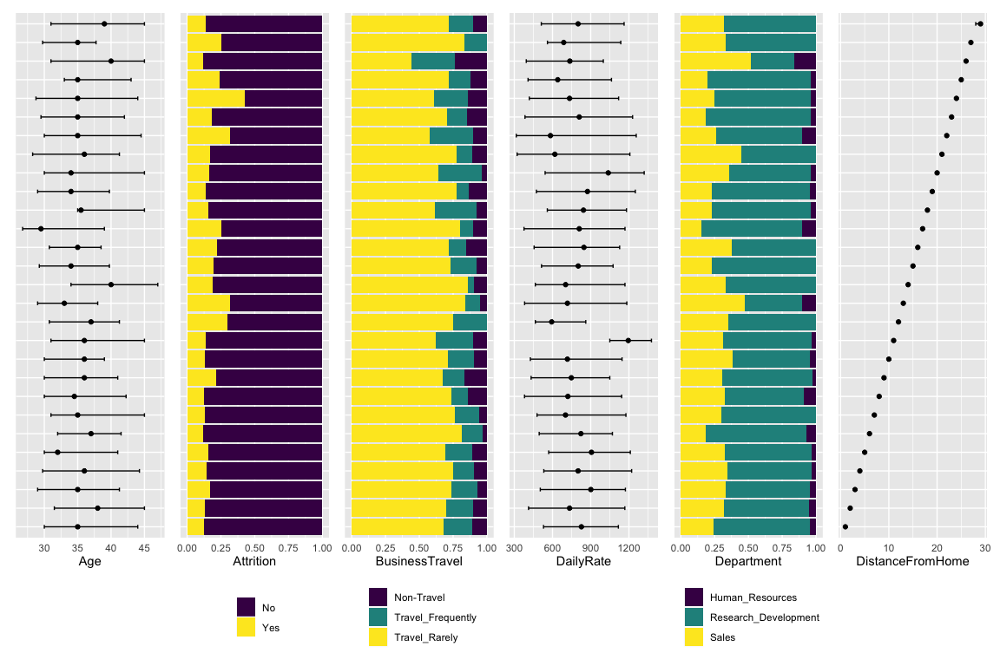
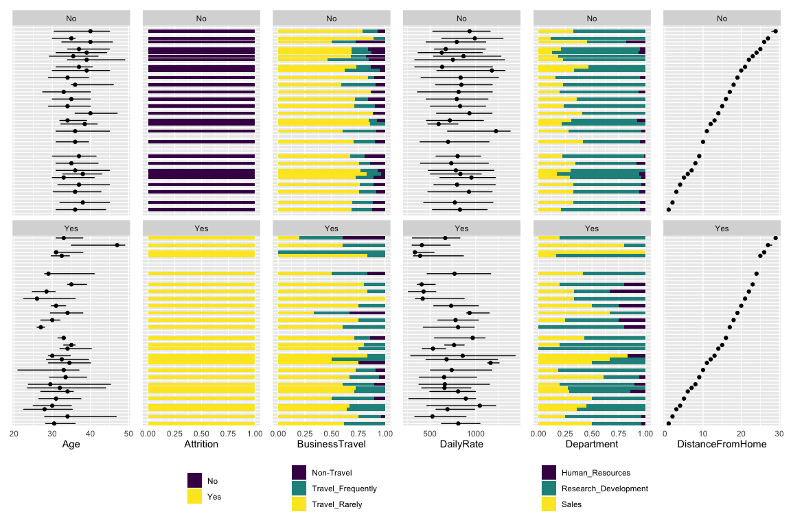
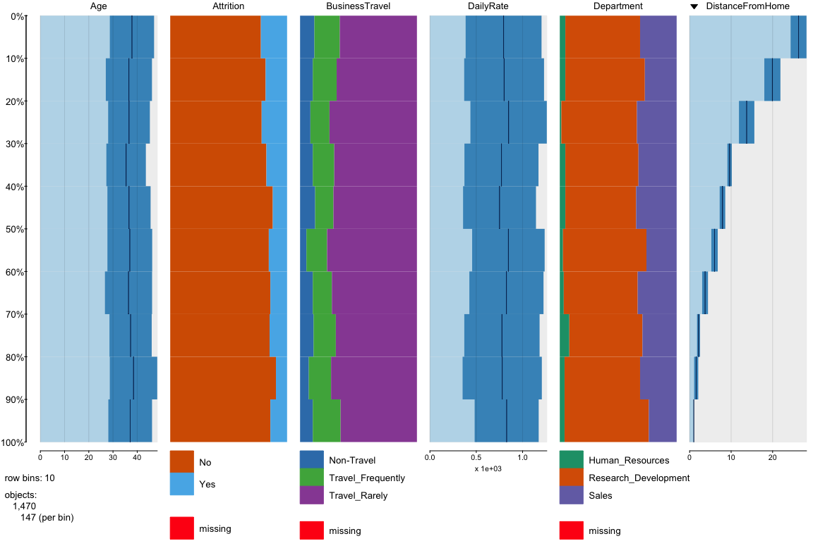

**WIP: IN DEVELOPMENT**

#### A ggplot2 based implementation of tabplot ([github repo](https://github.com/mtennekes/tabplot), [paper](http://www.jds-online.com/file_download/379/JDS-1108.pdf))

tabplot offers a fast way to eyeball dataframes (my go-to tool over
years). This uncovers possible interactions between variables when
sorted by some variable. Hence, it builds intuition for any further
modeling.

What is different from tabplot
------------------------------

-   Adds out-of-box support for grouped tibbles (tidy dataframes)
-   Based on ggplot for flexible geoms for different variable types
-   dfvis might not be as fast as tabplot

Illustrations
-------------

    pacman::p_load("dplyr", "tabplot", "dfvis")

    data("attrition", package = "modeldata")
    attrition = as_tibble(attrition)
    attrition_6 = attrition[, 1:6]
    skimr::skim(attrition_6)

<table>
<caption>Data summary</caption>
<tbody>
<tr class="odd">
<td style="text-align: left;">Name</td>
<td style="text-align: left;">attrition_6</td>
</tr>
<tr class="even">
<td style="text-align: left;">Number of rows</td>
<td style="text-align: left;">1470</td>
</tr>
<tr class="odd">
<td style="text-align: left;">Number of columns</td>
<td style="text-align: left;">6</td>
</tr>
<tr class="even">
<td style="text-align: left;">_______________________</td>
<td style="text-align: left;"></td>
</tr>
<tr class="odd">
<td style="text-align: left;">Column type frequency:</td>
<td style="text-align: left;"></td>
</tr>
<tr class="even">
<td style="text-align: left;">factor</td>
<td style="text-align: left;">3</td>
</tr>
<tr class="odd">
<td style="text-align: left;">numeric</td>
<td style="text-align: left;">3</td>
</tr>
<tr class="even">
<td style="text-align: left;">________________________</td>
<td style="text-align: left;"></td>
</tr>
<tr class="odd">
<td style="text-align: left;">Group variables</td>
<td style="text-align: left;">None</td>
</tr>
</tbody>
</table>

**Variable type: factor**

<table>
<thead>
<tr class="header">
<th style="text-align: left;">skim_variable</th>
<th style="text-align: right;">n_missing</th>
<th style="text-align: right;">complete_rate</th>
<th style="text-align: left;">ordered</th>
<th style="text-align: right;">n_unique</th>
<th style="text-align: left;">top_counts</th>
</tr>
</thead>
<tbody>
<tr class="odd">
<td style="text-align: left;">Attrition</td>
<td style="text-align: right;">0</td>
<td style="text-align: right;">1</td>
<td style="text-align: left;">FALSE</td>
<td style="text-align: right;">2</td>
<td style="text-align: left;">No: 1233, Yes: 237</td>
</tr>
<tr class="even">
<td style="text-align: left;">BusinessTravel</td>
<td style="text-align: right;">0</td>
<td style="text-align: right;">1</td>
<td style="text-align: left;">FALSE</td>
<td style="text-align: right;">3</td>
<td style="text-align: left;">Tra: 1043, Tra: 277, Non: 150</td>
</tr>
<tr class="odd">
<td style="text-align: left;">Department</td>
<td style="text-align: right;">0</td>
<td style="text-align: right;">1</td>
<td style="text-align: left;">FALSE</td>
<td style="text-align: right;">3</td>
<td style="text-align: left;">Res: 961, Sal: 446, Hum: 63</td>
</tr>
</tbody>
</table>

**Variable type: numeric**

<table>
<thead>
<tr class="header">
<th style="text-align: left;">skim_variable</th>
<th style="text-align: right;">n_missing</th>
<th style="text-align: right;">complete_rate</th>
<th style="text-align: right;">mean</th>
<th style="text-align: right;">sd</th>
<th style="text-align: right;">p0</th>
<th style="text-align: right;">p25</th>
<th style="text-align: right;">p50</th>
<th style="text-align: right;">p75</th>
<th style="text-align: right;">p100</th>
<th style="text-align: left;">hist</th>
</tr>
</thead>
<tbody>
<tr class="odd">
<td style="text-align: left;">Age</td>
<td style="text-align: right;">0</td>
<td style="text-align: right;">1</td>
<td style="text-align: right;">36.92</td>
<td style="text-align: right;">9.14</td>
<td style="text-align: right;">18</td>
<td style="text-align: right;">30</td>
<td style="text-align: right;">36</td>
<td style="text-align: right;">43</td>
<td style="text-align: right;">60</td>
<td style="text-align: left;">▂▇▇▃▂</td>
</tr>
<tr class="even">
<td style="text-align: left;">DailyRate</td>
<td style="text-align: right;">0</td>
<td style="text-align: right;">1</td>
<td style="text-align: right;">802.49</td>
<td style="text-align: right;">403.51</td>
<td style="text-align: right;">102</td>
<td style="text-align: right;">465</td>
<td style="text-align: right;">802</td>
<td style="text-align: right;">1157</td>
<td style="text-align: right;">1499</td>
<td style="text-align: left;">▇▇▇▇▇</td>
</tr>
<tr class="odd">
<td style="text-align: left;">DistanceFromHome</td>
<td style="text-align: right;">0</td>
<td style="text-align: right;">1</td>
<td style="text-align: right;">9.19</td>
<td style="text-align: right;">8.11</td>
<td style="text-align: right;">1</td>
<td style="text-align: right;">2</td>
<td style="text-align: right;">7</td>
<td style="text-align: right;">14</td>
<td style="text-align: right;">29</td>
<td style="text-align: left;">▇▅▂▂▂</td>
</tr>
</tbody>
</table>

### Ungrouped case

    autoplot(attrition_6, sort_column_name = "DistanceFromHome")

### Grouped Case

    suppressWarnings(
      attrition_6 %>% 
        group_by(Attrition) %>% 
        autoplot(sort_column_name = "DistanceFromHome")
      )

    ## Adding missing grouping variables: `Attrition`
    ## Adding missing grouping variables: `Attrition`

### tabplot

    tabplot::tableplot(attrition_6, sortCol = "DistanceFromHome", nBins = 10)

Development and Contribution
----------------------------

-   Contributions are welcome!
-   Create interactive version (with shiny?)
